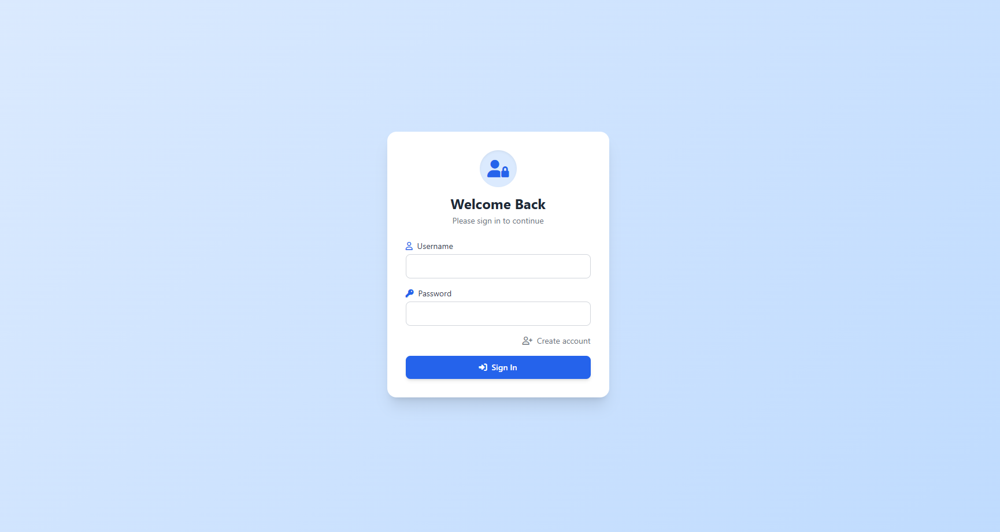
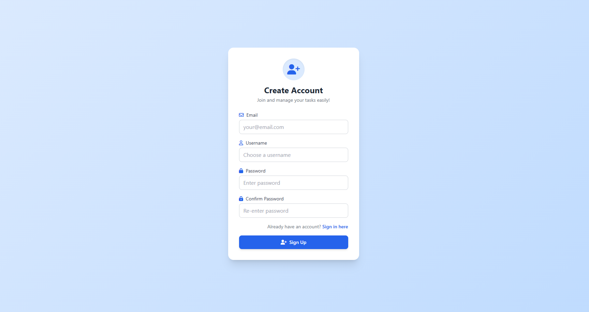
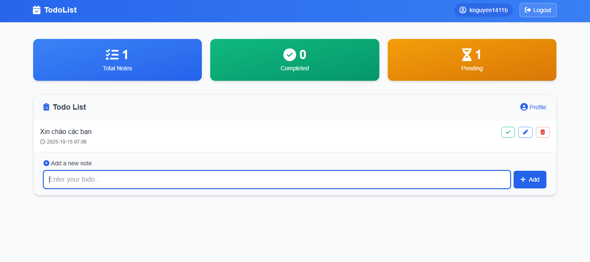
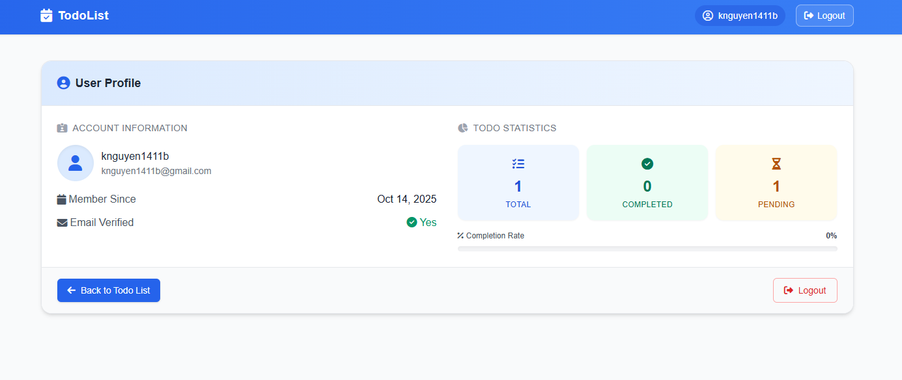

# 📝 **TodoList (Flask) – Notes & To-Do App**

A clean and minimal **Flask-based TodoList application** featuring user authentication, CRUD for notes, task completion tracking, and a personal profile dashboard.  
Designed with **TailwindCSS** and **Font Awesome** for a modern and responsive user experience.

---

## ⚙️ **Tech Stack**

- **Backend:** Flask, Flask-Login, SQLAlchemy (SQLite)
- **Frontend:** Jinja2 Templates, TailwindCSS (via CDN), Font Awesome
- **Utilities:** python-dotenv, pytest

---

## ✨ **Features**

- 🔐 **User Authentication:** Register, login, logout, and secure route protection via Flask-Login.
- 🗒️ **Notes Management:** Create, edit, delete, and toggle note completion status.
- 📊 **Profile Dashboard:** Displays total, completed, and pending notes with completion rate visualization.
- ⚙️ **JSON API:** Provides endpoints for managing notes (list, details, update, delete, toggle).
- 🎨 **Modern Interface:** Clean UI with TailwindCSS, responsive layout, and smooth modal editing.

---

## 🧩 **Project Structure**

app/
├── api/ # Blueprints for routes (user, notes)
├── services/ # Business logic (user_service.py, note_service.py)
├── templates/ # Jinja2 templates (base, index, profile)
├── utils/ # Helpers, validators, error handlers
├── models.py # User & Note models
├── db.py # SQLAlchemy initialization
instance/
│ └── todolist.db # Auto-created SQLite database
run.py # Application entry point
requirements.txt # Dependencies
tests/ # Basic pytest tests

---

## ⚡ **Main Routes**

### 🌐 Web Interface

| Method                        | Route             | Description                         |
| ----------------------------- | ----------------- | ----------------------------------- |
| `GET /`, `POST /`             | Home page         | View and add notes (requires login) |
| `POST /edit-note/<id>`        | Edit note content |
| `POST /delete-note/<id>`      | Delete note       |
| `POST /complete-note/<id>`    | Toggle completion |
| `GET /signin`, `POST /signin` | Sign in           |
| `GET /signup`, `POST /signup` | Register new user |
| `GET /logout`                 | Logout            |
| `GET /profile`                | User profile page |

### 🧠 JSON API

| Method                         | Endpoint              | Description           |
| ------------------------------ | --------------------- | --------------------- |
| `GET /api/notes?completed=true | false`                | Fetch notes by status |
| `GET /api/notes/<id>`          | Retrieve note details |

---

## 🧪 **Testing**

- Automated tests using **pytest** for validation logic and service functions.
- Includes checks for email validation, password strength, and user data integrity.

---

## 🚀 **Deployment Notes**

- TailwindCSS loaded via CDN for simplicity (no build step).
- Database and tables auto-created on first run.
- For production:
  - Use a unique and secure `KEY`.
  - Run with **Gunicorn/uWSGI** behind **Nginx** (avoid `app.run()` directly).
  - Optionally migrate to PostgreSQL/MySQL via `SQLALCHEMY_DATABASE_URI`.

---

## 🔮 **Future Improvements**

- 🧭 Pagination and search functionality.
- 🏷️ Tags or labels for better note organization.
- 🖼️ Profile editing with avatar upload.
- ✅ More comprehensive tests for `NoteService` and API endpoints.

---

## 📄 **License**

This project is for **educational and demonstration purposes**.  
No license included — add one if you plan to distribute or deploy publicly.

---

## 🖼️ **Screenshots**

|                  Sign In                   |                  Sign Up                   |
| :----------------------------------------: | :----------------------------------------: |
|  |  |

|                    Home                     |                   Profile                   |
| :-----------------------------------------: | :-----------------------------------------: |
|  |  |

---

**Made by Knguyen1411b ❤️**
